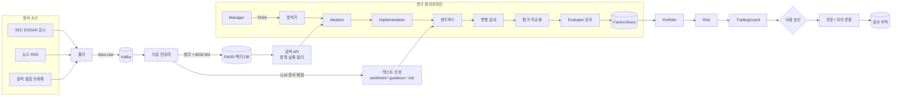
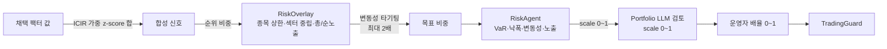
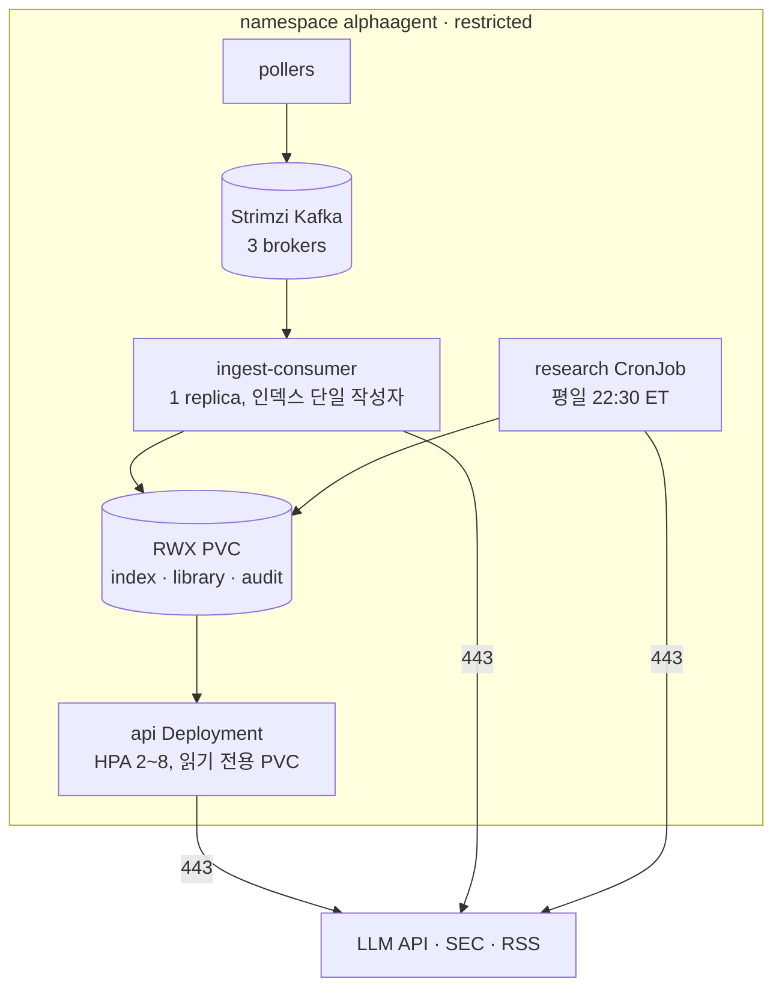

# 아키텍처

비정형 금융 텍스트에서 알파 팩터를 찾고, 검증하고, 통제된 환경에서 운용하는 시스템입니다.
패키지 이름은 `alphaagent`이고, 크게 다섯 층으로 나뉩니다.

| 층 | 역할 | 주요 모듈 |
|---|---|---|
| 데이터 | 문서 수집, 청크 분할, 임베딩, 벡터 검색, 가격 데이터 | `ingestion/`, `embeddings/`, `vectorstore/`, `retrieval/`, `data/`, `streaming/` |
| 추론 | LLM 백엔드, RAG 기반 CoT 에이전트, 메시지 프로토콜, 공유 메모리 | `llm/`, `agents/` |
| 연구 | 팩터 아이디어 → 코드 → 샌드박스 실행 → 편향 검사 → 평가 → 채택 | `pipeline.py`, `sandbox/`, `validation/`, `backtest/`, `features/`, `library.py` |
| 운용 | 팩터 결합, 포지션 산출, 리스크 감시, 앙상블 결정 | `team.py`, `agents/portfolio.py`, `agents/risk_agent.py`, `agents/ensemble.py`, `risk/`, `monitoring/` |
| 통제 | 회로 차단기, 킬 스위치, 사람 승인, 감사 추적, 운영자 API, 배포 | `ops/`, `deploy/` |

## 전체 흐름



## 데이터 층

- **문서 모델** (`documents.py`): 모든 문서는 `ticker`, `doc_type`(transcript / sec_filing / news), `published_at`을 반드시 갖습니다.
  `doc_id`는 종목·유형·날짜·출처의 해시라서 같은 문서를 여러 번 받아도 한 번만 색인됩니다.
- **청크** (`ingestion/chunking.py`): 문단 → 문장 → 고정 길이 순으로 나누고 겹침을 둡니다. 청크 앞에
  `[TICKER | 유형 | 날짜] 제목` 머리말을 붙여 임베딩이 어느 회사·시점의 글인지 알 수 있게 합니다.
- **임베딩** (`embeddings/`): 기본 BGE-M3(1024차원), 선택 FinBERT, 오프라인용 해싱 임베더. 모두 L2 정규화된 벡터를 내므로 내적이 코사인 유사도입니다.
- **벡터 저장소** (`vectorstore/faiss_store.py`): `IndexIDMap2(IndexFlatIP)`. 필터를 먼저 허용 ID 목록으로 바꾼 뒤
  FAISS `IDSelectorBatch`로 그 안에서만 검색합니다. 저장은 임시 파일에 쓴 뒤 이름을 바꾸는 방식이라 읽는 쪽이 반쯤 쓰인 파일을 보지 않습니다.
  Pinecone/Weaviate는 같은 `VectorStore` 인터페이스로 교체할 수 있습니다.
- **스트리밍** (`streaming/`): `docs.raw → docs.indexed / signals.text` 토픽. 컨슈머는 배치 처리가 끝난 뒤에만 오프셋을 커밋하고(최소 1회 전달), 문서 ID로 중복을 거르므로 재전달돼도 결과가 같습니다.

## 추론 층

- **LLM 백엔드** (`llm/`): 에이전트는 `LLMClient` 인터페이스만 씁니다. 구현은 Claude(기본 `claude-opus-5-5`, 스트리밍, effort 설정, 거절 시 서버측 대체 모델),
  vLLM(OpenAI 호환 로컬 서버), `MockLLM`(작업 종류별 결정적 응답) 세 가지입니다.
- **QuantAgent** (`agents/base.py`): 매 호출마다 ① 질의로 문서 검색(종목·기준일 필터) ② 공유 메모리 요약 ③ 단계별 추론 지시를 묶어 프롬프트를 만들고,
  응답에서 신뢰도(`[Confidence: x]`), JSON, 코드 블록을 뽑아 `AgentDecision`으로 돌려준 뒤 메모리에 기록합니다.
- **공유 메모리** (`agents/memory.py`): 라운드별로 모든 에이전트 행동을 쌓습니다(M(t) = M(t-1) ∪ {a_i(t)}). JSONL로 영속화됩니다.
- **메시지 프로토콜** (`agents/protocol.py`): `TASK / RESULT / CRITIQUE / VOTE / ALERT / INFO` 유형, `correlation_id`로 요청과 응답을 묶습니다.
  같은 프로세스에서는 `MessageBus`, 여러 파드에서는 Kafka를 거치는 `BrokerMessageBus`를 씁니다.

## 연구 층: AlphaGenerationPipeline

| 단계 | 하는 일 | 통과 조건 |
|---|---|---|
| 1. 아이디어 | 검색 문서 + 지난 결과(FactorLibrary 피드백)로 팩터 제안 | JSON으로 파싱되는 아이디어 |
| 2. 구현 | `compute_alpha(df) -> Series` 작성 | 코드 계약 준수 |
| 3. 샌드박스 | AST 정책 검사 → 격리 프로세스 실행 → 출력 검증 | 임포트·파일·dunder 없음, 커버리지 30% 이상, 횡단면 변화 존재 |
| 4. 예측 편향 | 정적 패턴 + 데이터 절단 테스트 | 미래 데이터를 지워도 과거 값 동일 |
| 5. 평가 | IS/OOS 분할, 부호는 IS에서만 결정, 비용 차감 백테스트 | OOS \|IC\| ≥ 0.02, t ≥ 2, 순샤프 > 0 |
| 6. 안정성 | 워크포워드(구간별 OOS IC), 스패닝 테스트 | 양수 구간 ≥ 50%, 절편 t ≥ 1 |
| 7. 새로움 | 알려진 5개 팩터 대비 직교화, 채택 팩터와 중복도 | 최대 상관 ≤ 0.7, 잔차 IC ≥ 0.01 |
| 8. 검토 | Evaluator 에이전트 판정 | 승인 (단, 통계 기준 미달은 승인 불가) |

3·4단계에서 실패하면 오류 내용을 구현 에이전트에게 돌려주고 고쳐 달라고 합니다(기본 2회). 모든 팩터는 채택 여부와 상관없이 지표와 함께 FactorLibrary에 남습니다.

### 샌드박스 보안 층

1. AST 정책: `import`, `open/exec/eval/getattr` 등, dunder 속성, 파일·네트워크 관련 pandas/numpy 메서드, 모듈 최상위 실행문 금지
2. `python -I`로 별도 인터프리터 실행(사용자 환경·스크립트 경로 미포함), 축소된 builtins
3. 시간 제한, POSIX에서는 메모리 제한
4. 결과는 `np.save(allow_pickle=False)` float 배열로만 회수 (자식 프로세스가 만든 pickle은 절대 열지 않음)
5. 운영 환경에서는 비루트·읽기 전용 FS·권한 제거·NetworkPolicy가 걸린 파드 안에서 실행

### 시점(point-in-time) 규칙

| 대상 | 규칙 |
|---|---|
| 문서 검색 | `as_of` 이후 발행 문서 제외 |
| 텍스트 신호 | 발행일 **다음 거래일**부터 사용 가능, 반감기 감쇠, 60거래일 후 소멸 |
| 팩터 값 | t일 값은 t일 종가까지의 정보만 사용 (절단 테스트로 강제) |
| 백테스트 | t일 신호 → t+1일 종가 체결 → t+2일 수익 |
| 팩터 방향 | IS 구간 IC 부호로만 결정 |
| 워크포워드 | 학습 구간 라벨이 검증 시작 전에 끝나도록 예측 기간만큼 제거 |
| 앙상블 가중치 | t일 투표는 t+h일 수익이 확정된 뒤에만 반영 |
| 과거 재실행 | 각 기준일 실행은 그 날까지의 데이터만 사용, 채점은 다음 달 데이터로 |

## 운용 층



- 위험을 늘리는 결정은 수치 규칙만 할 수 있고, LLM과 운영자 오버라이드는 위험을 줄이는 방향으로만 작동합니다.
- **ResearchTeam** (`team.py`): Manager가 목표를 하위 과제로 나눠 분석가에게 TASK를 보내고, 분석가는 파이프라인을 실행해 RESULT로 답합니다.
  Manager가 배포 팩터와 비중을 정하면 Portfolio → Risk → 앙상블 순서로 진행합니다.
- **앙상블** (`agents/ensemble.py`): 팩터별 분위 투표와 LLM 분석가 투표를 가중 합산합니다. 가중치는 횡단면 초과수익 기준 적중률로 갱신하고, 1위가 동점이면 보유를 택합니다.

## 통제 층

| 장치 | 작동 조건 | 결과 | 해제 |
|---|---|---|---|
| LLM 회로 차단기 | 연속 실패 N회 | 호출 차단, 대체 모델 사용 | 대기 시간 후 시험 호출 성공 시 자동 |
| 거래 차단기 | 일간 손실, 낙폭, 데이터 지연, 리스크 중단 요청 | 거래 동결 (래치) | 운영자 리셋 |
| 회전율 상한 | 목표까지 변화량이 한도 초과 | 목표까지 일부만 이동 | 자동 |
| 킬 스위치 | 운영자 조작 | 전 포지션 청산 | 운영자 해제 |
| 승인 대기열 | 종목당 비중 변화가 임계값 초과 | 해당 종목 기존 비중 유지 | 운영자 승인 시 다음 스텝 반영 |
| 팩터 일시정지 | 운영자 조작 | 해당 팩터 제외 | 운영자 재개 |

모든 통제 동작과 주문, LLM 호출은 `AuditTrail`에 기록됩니다. 각 레코드는 `hash = sha256(prev_hash + 레코드)`로 앞 레코드와 연결돼 있어
과거 기록을 수정하거나 지우면 `verify()`가 끊어진 위치를 알려 줍니다. 규제 보고서는 이 기록에서 알고리즘 목록, 승인 이력, 한도 위반, 차단기·킬 스위치 사용, LLM 사용량을 뽑습니다.

## 배포 구성



- 모든 파드는 비루트, 읽기 전용 루트 FS, 모든 권한 제거, seccomp RuntimeDefault입니다.
- NetworkPolicy는 기본 차단이며 DNS, Kafka, 외부 HTTPS(사설 대역 제외)만 엽니다.
- 비밀값(Claude API 키, SEC 연락처)은 매니페스트에 넣지 않고 별도 Secret으로 만듭니다.

## 디렉터리 구조

```
alphaagent/
  config.py, documents.py, cli.py
  ingestion/   embeddings/   vectorstore/   retrieval/        데이터
  llm/         agents/                                        추론
  pipeline.py  sandbox/  validation/  backtest/  features/  library.py   연구
  team.py      risk/     monitoring/                          운용
  streaming/   ops/                                           통제·실시간
  data/        합성 데이터, 실제 가격 로더
deploy/        Dockerfile, docker-compose, k8s/
scripts/       demo_pipeline, historical_validation, demo_team, demo_live
tests/         86개 테스트
docs/          이 문서들
```
